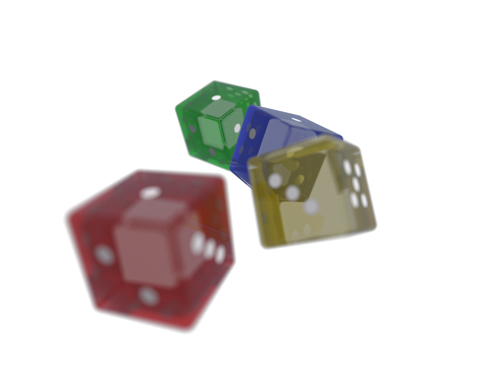
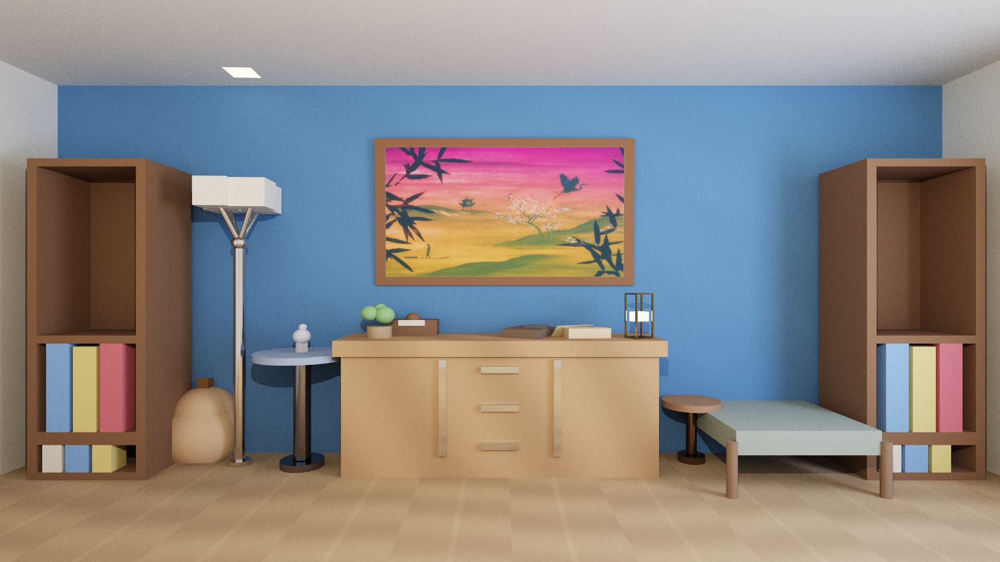

[](plugins/core_studies/dice.c)

<details>
<summary>Open Shader Gallery</summary>

[](docs/shaders.md#master_class)
[](docs/shaders.md#crystal_hall)
[](docs/shaders.md#sphere_tracing)
[](pocs/blue_wall_scene/README.md)
[](pocs/hsv_picker/README.md)

</details>

[](docs/shaders.md)

---

Win32 CPU-shader host for experimenting with image shaders, ray-tracing studies, interactive widgets, text rendering, and scene-reduction POCs.

Each shader is a plain C function:

```c
vec4_t shader_main(vec2_t fragCoord, const shader_uniforms_t *uniforms);
```

The host runs that function across CPU worker threads, writes the resulting `vec4_t` image into a CPU-owned float32 frame surface, and presents that surface through a backend layer and separate popup window.

## What This Repo Is

- a CPU-shader sketchbook
- a small host for selecting, inspecting, and executing shaders
- a proving ground for shader-owned static assets through `buffers_init()`
- a place for larger POCs that still reuse the same shader contract

This is not trying to be a generalized game engine or shader database yet.

## Current Host Model

The app now has a clear split:

- `src/win.c`
  - host shell, dialog state, selection, execute/stop/reset flow, popup preview layout
- `src/runtime_session.c`
  - worker pool, frame timing, shader buffers, runtime/backend lifetime, frame execution
- `src/display.c`
  - borderless popup display surface and mouse mapping
- `src/present/*.c`
  - backend-neutral presentation surface and dispatch layer
- `src/dxgi/*.c`
  - shared DXGI support: factory, adapter, output, color-space, and HDR capability helpers
- `src/dx12/*.c`
  - DirectX 12 presentation backend built on the shared DXGI support layer
- `src/ogl/*.c`
  - OpenGL-requested presentation mode currently routed through the shared DXGI/DirectX 12 presenter
- `src/vk/*.c`
  - Vulkan presentation backend
- `src/gdi/*.c`
  - simple BGRA8 down-convert fallback presenter
- `src/stats.c`
  - dialog UI and controls

The host comes up dialog-first. You inspect a shader, click `Execute`, and the popup/runtime are created lazily. `Stop` returns the host to idle.

The current presentation policy is:

- default to DirectX 12
- allow `--backend=dx12|ogl|vk|gdi`
- route `--backend=ogl` through the shared DXGI/DirectX 12 presentation path for now
- fall back to GDI if the requested backend cannot be created
- show the active backend in the dialog title

## Shader Model

Shaders declare their own metadata in their header macro:

- display name
- blurb
- feature flags
- preferred render size
- optional `buffers_init()` hook

Feature flags currently drive:

- time uniform updates
- mouse uniform updates
- key uniform updates
- frame-driven redraw
- temporal accumulation

Static assets are shader-owned. A shader that needs textures or other data prepares them once in `buffers_init()` and accesses them through `uniforms->buffers`.

## Build

From the repo root:

```powershell
cmd /c _build.cmd
```

That builds:

- `bin.exe`
- the modeless dialog resource
- the standalone HSV picker tool POC

The build expects local Windows tooling, including:

- `clang`
- `llvm-rc`
- the Windows SDK / link environment
- Vulkan SDK exposed through `%VULKAN_SDK%`

## Run

Launch:

```powershell
.\bin.exe
```

Backend selection examples:

```powershell
.\bin.exe --backend=dx12
.\bin.exe --backend=gdi
.\bin.exe --backend=ogl
```

At the moment, `dx12`, `ogl`, `vk`, and `gdi` are the public backend choices. `dx12` is the default presenter. `dxgi` is still accepted as a compatibility alias for the same DirectX 12 path, but DXGI is now treated as shared support infrastructure rather than a backend in its own right. The DirectX 12 backend uses shader color-space metadata plus DXGI output probing to choose an SDR surface for display-referred shaders and to prefer HDR scRGB or HDR10 surfaces when the active output exposes them. The current `ogl` mode intentionally reuses that same DXGI/DirectX 12 presentation path instead of trying to prove HDR through a standalone WGL window surface. Vulkan likewise prefers an scRGB HDR swapchain when the surface exposes it; otherwise it stays on Vulkan and reports that HDR is not present to the surface.

Basic flow:

1. Select a shader in the dialog.
2. Read the feature line and blurb.
3. Click `Execute`.
4. Use `Stop` to tear the active runtime down cleanly.

Useful runtime behavior:

- `Esc` exits
- `V` toggles vsync
- `R` resets the active shader
- right-drag the popup window to move it

## Repo Layout

- `src/`
  - host, runtime, shared shader support, and core shaders
- `docs/`
  - shader and architecture writeups
- `pocs/`
  - self-contained experiments that still use the host/shader model
- `.AGENTS/`
  - journal snapshots and longer-horizon planning notes

## Documentation

Start here:

- [docs/Actual_HDR.md](docs/Actual_HDR.md)
  - what this repo should mean by "actual HDR", and which backends currently qualify
- [docs/shaders.md](docs/shaders.md)
  - shader contract, feature flags, and shader index
- [sdk/SDK.md](sdk/SDK.md)
  - plugin and shader SDK overview for extending the host
- [plugins/monitor_diagnostic/monitor_diagnostic.md](plugins/monitor_diagnostic/monitor_diagnostic.md)
  - monitor diagnostic plugin notes and test-pattern rationale
- [pocs/shader_variables/readme.md](pocs/shader_variables/readme.md)
  - shader-variable control POC notes for runtime-editable parameters

Deep dives:

- [docs/MASTER_CLASS.md](docs/MASTER_CLASS.md)
  - how the flagship still shader converges quickly
- [pocs/blue_wall_scene/README.md](pocs/blue_wall_scene/README.md)
  - Blender-driven scene reconstruction POC
- [pocs/mtsdf/README.md](pocs/mtsdf/README.md)
  - MTSDF text rendering POC
- [pocs/sdf_fixed/README.md](pocs/sdf_fixed/README.md)
  - low-tech fixed-grid SDF text POC
- [pocs/capture_animation/README.md](pocs/capture_animation/README.md)
  - deterministic capture-to-APNG animation POC
- [pocs/hsv_picker/README.md](pocs/hsv_picker/README.md)
  - shader logic reused as a standalone tool window

## Notable Shaders And POCs

- `master_class`
  - the current flagship static 3D scene
- `hsv_picker`
  - interactive shader that also proved reusable tool logic
- `blue_wall_v2_A` through `blue_wall_v2_E`
  - staged Blender-scene reconstruction in `pocs/blue_wall_scene`
- `mtsdf_hello_world`
  - high-quality text atlas POC using shader-owned texture buffers
- `sdf_fixed_hello_world`
  - simpler fixed-grid SDF text path for low-code workflows
- `animated_sprite`
  - transparent sprite-animation POC intended for sequential capture and APNG assembly

## Current Direction

The large architecture questions are mostly settled for this phase:

- shader catalog and dialog-first execution are in place
- feature-driven redraw is in place
- shader-owned buffers and texture support are in place
- runtime/session logic has been split away from host orchestration

The near-term work is now consolidation and polish:

- cleaner runtime snapshots for dialog updates
- tighter execute/stop/reset transitions
- continued extraction of only truly reusable helpers from POCs

## License Notes

This repo contains a mix of original code, generated artifacts, and POC assets. Some POCs track external scene or tool sources in their local docs. Check the README inside a given `pocs/` folder for source and attribution details before reusing its assets.
