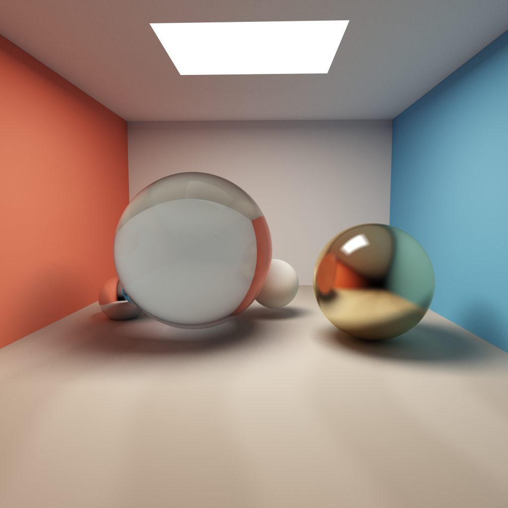
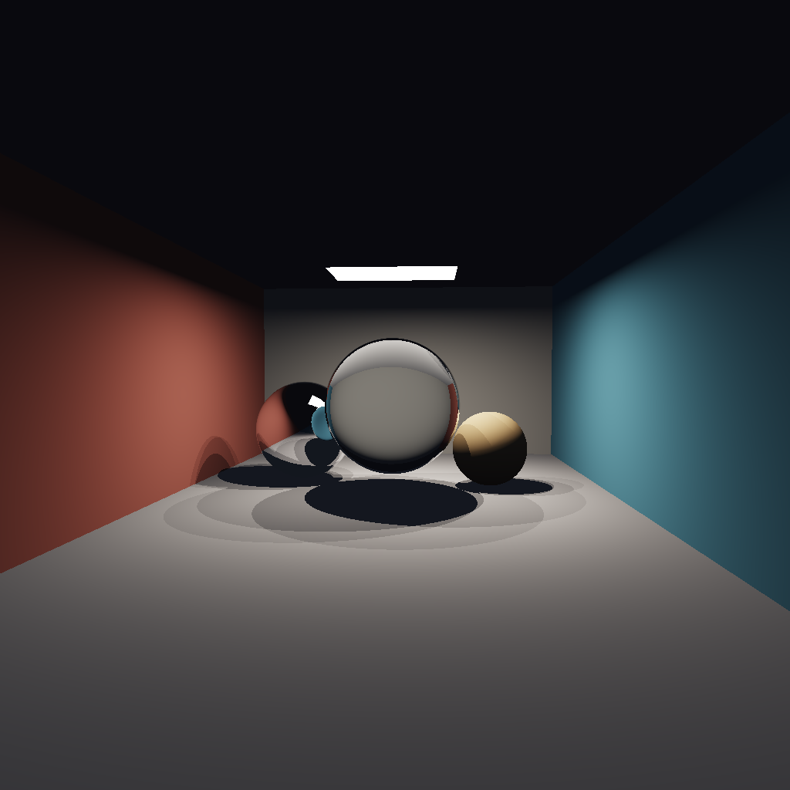
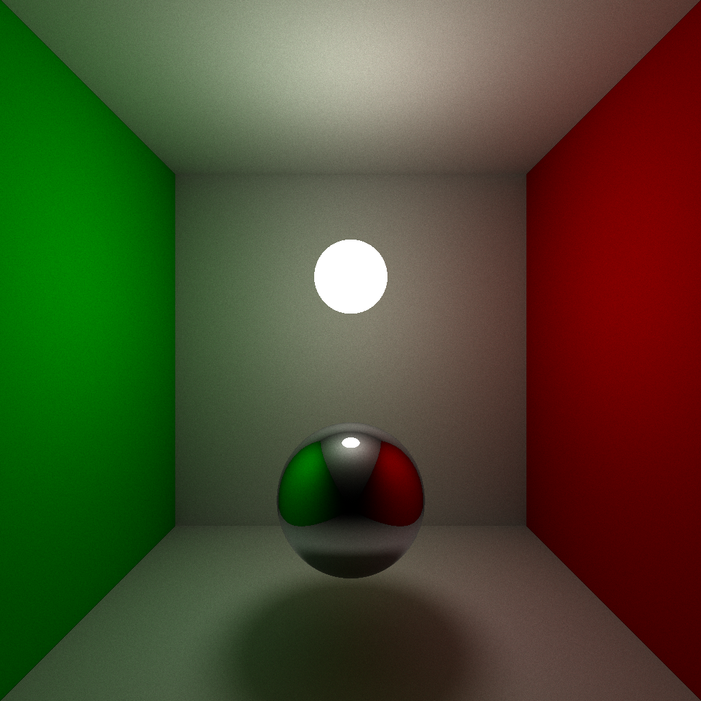
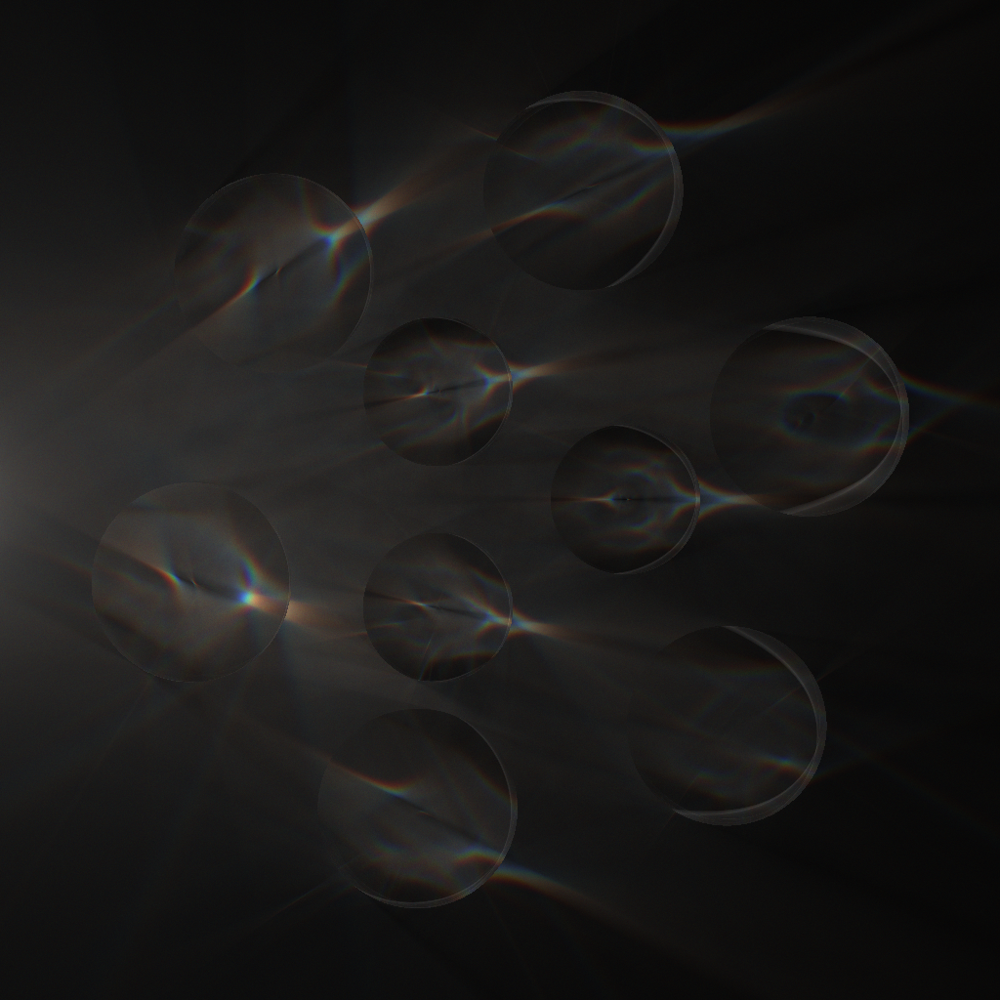
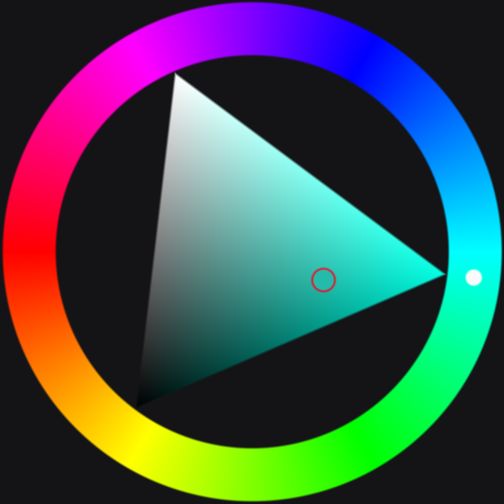
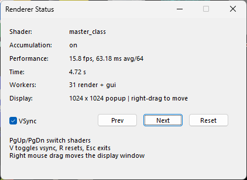

> [!CAUTION]
> **Experimental HDR DX12 Branch**  
> This branch uses DX12 to present the image data without texture processing.

---

<details>
<summary>Open Shader Gallery</summary>

[](docs/shaders.md#master_class)
[](docs/shaders.md#crystal_hall)
[](docs/shaders.md#sphere_tracing)
[](docs/shaders.md#glass_disks)
[](pocs/hsv_picker_tool.md)

</details>

[](docs/shaders.md)

---

# C-CPUShader
Minimal CPU shader multithreaded renderer written in pure C - raw Win32, no libraries, no abstraction layers. Pixels, threads, and math from scratch.</br>
I just felt like doing something with C.</br>
The math library isn't done yet, I just added the functions that I needed for the demo.</br>

## Compile
```bash
gcc src/*.c src/shaders/*.c -o build/bin.exe -lgdi32
```

## Code
Simply init the window and choose the render function with the number of threads you want to use from your CPU.
The last parameter is to enable temporal accumulation for ray tracing shaders.

```c
#include "defines.h"
#include "win.h"
#include "shaders/sphere_tracing.h"
#include "shaders/glass_disks.h"

vec4_t main_image(vec2_t fragCoord, vec2_t resolution, float time, uint frame)
{
    return glass_disks_main(fragCoord, resolution, time, frame);
}

int main(void)
{
    //Init Window
    window_create("Renderer", 700, 450);

    //Render Loop with 10 threads and temporal accumulation enabled
    window_run(main_image, 10, true);

    return 0;
}
```
