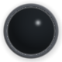
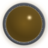
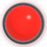

# Shader Variables POC — Composable UI Components

## Overview

The shader variables plugin (`pocs/shader_variables/`) demonstrates the SDK's
runtime variable system through composable UI components.  Each shader renders
a single transparent widget driven entirely by typed variables — no
recompilation needed to change color, state, or material.

> **Generate the images below** by running `generate_images.cmd` from the
> repository root after building.  The script captures 12 representative
> states into `images/`.

---

## Components

### Toggle Switch (`toggle_switch`)
**160×80** — iOS-style pill toggle with sliding knob.

| Variable | Type | Default | Purpose |
|---|---|---|---|
| `state` | FLOAT | 0.0 | Knob position and track blend (0=off, 1=on) |
| `active_color` | VEC3 | 0.30, 0.78, 0.47 | Track color when on |
| `knob_color` | VEC3 | 1.0, 1.0, 1.0 | Knob surface tint |

| Off (`state=0.0`) | Mid (`state=0.5`) | On (`state=1.0`) | Themed (`active_color=0.55,0.28,0.82`) |
|:---:|:---:|:---:|:---:|
|  |  |  |  |

Techniques: capsule SDF, hemisphere-lit dome knob with specular highlight
and fresnel rim, soft drop shadow, track inner shadow for concavity,
smoothstep-interpolated state for organic motion.

```
bin.exe --capture --shader=toggle_switch --var state=0.5
bin.exe --capture --shader=toggle_switch --var state=1.0 --var active_color=0.55,0.28,0.82
```

---

### Radial Gauge (`radial_gauge`)
**192×192** — 270-degree arc meter with rounded endcaps and value pip.

| Variable | Type | Default | Purpose |
|---|---|---|---|
| `value` | FLOAT | 0.72 | Fill amount (0.0 to 1.0) |
| `arc_color` | VEC3 | 0.22, 0.65, 0.88 | Filled arc color |
| `track_color` | VEC3 | 0.18, 0.19, 0.22 | Background track color |
| `thickness` | FLOAT | 0.10 | Arc stroke width (0.04–0.20) |

| Low (`value=0.15`) | Default (`value=0.72`) | Critical (red, `value=0.95`) | Thick gold |
|:---:|:---:|:---:|:---:|
|  |  |  |  |

Techniques: analytical arc SDF with rounded endcaps (proper distance to
arc endpoints when outside angular range), per-pixel atan2 for angular
fill masking, brightness gradient toward the leading edge, specular pip
at the value position, soft glow behind the value arc.

```
bin.exe --capture --shader=radial_gauge --var value=0.95 --var arc_color=0.88,0.22,0.18
bin.exe --capture --shader=radial_gauge --var value=0.60 --var arc_color=0.92,0.72,0.15 --var thickness=0.18
```

---

### Status Indicator (`status_indicator`)
**80×80** — LED dome with metal bezel ring and emissive glow.

| Variable | Type | Default | Purpose |
|---|---|---|---|
| `color` | VEC3 | 0.18, 0.85, 0.32 | LED color |
| `brightness` | FLOAT | 0.85 | Emission (0=dark dome, 1=full glow) |
| `bezel_color` | VEC3 | 0.50, 0.52, 0.56 | Metal bezel tint |

| Off | Amber warning | Green active | Red alert |
|:---:|:---:|:---:|:---:|
|  |  |  |  |

Techniques: toroidal bezel cross-section with directional lighting and
inner specular band, hemisphere-normal glass dome with diffuse + specular
+ fresnel, emissive fill controlled by brightness with center brightening,
colored glow halo behind the bezel.

```
bin.exe --capture --shader=status_indicator --var brightness=0.55 --var color=0.92,0.65,0.10
bin.exe --capture --shader=status_indicator --var brightness=1.0 --var color=0.88,0.15,0.12
```

---

## Retained Components

### Button Round Metal (`button_round_metal`)
**64×64** — Transparent gel button with metal rim.  Variables: `primary_color`,
`depression`.

### Button Template (`button_template`)
**384×192** — Beveled button in recessed holder.  Variables: `press_depth`,
`diffuse_color`.

### Variable Probe (`variable_probe`)
**320×180** — Test harness exercising all six variable types (FLOAT, INT,
BOOL, VEC2, VEC3, VEC4).  Exists to validate `--var` parsing, not as a
visual showcase.

---

## Why Variables Matter

### 1. Scriptable Capture Sequences

Animate a toggle switch across 11 frames without touching the shader source:

```bat
for /L %%i in (0,1,10) do (
    bin.exe --capture --shader=toggle_switch --var state=0.%%i
)
```

Produces a complete off-to-on animation sequence as PNGs.

### 2. Theming Without Recompilation

Same binary, same DLL — three brand-colored gauges:

```bat
bin.exe --capture --shader=radial_gauge --var arc_color=0.88,0.22,0.30
bin.exe --capture --shader=radial_gauge --var arc_color=0.95,0.72,0.10
bin.exe --capture --shader=radial_gauge --var arc_color=0.22,0.65,0.88
```

### 3. Data-Driven Visualization

Feed sensor data into a gauge — green at 37%, red at 91%:

```bat
bin.exe --capture --shader=radial_gauge --var value=0.37 --var arc_color=0.18,0.85,0.32
bin.exe --capture --shader=radial_gauge --var value=0.91 --var arc_color=0.88,0.22,0.18
```

### 4. Component Composition

All components render on transparent backgrounds with correct premultiplied
alpha.  A host application can composite multiple widgets by rendering each
at its preferred size and blending the results.

### 5. Material Exploration

One status indicator shader covers hundreds of visual states:

- `brightness=0.0` — inert dark plastic dome
- `brightness=0.5, color=0.92,0.65,0.10` — dim amber warning
- `brightness=1.0, color=0.18,0.85,0.32` — bright green active
- `brightness=1.0, color=0.88,0.15,0.12` — red alert

---

## Architecture Notes

- **No input dependencies**: All components use `SHADER_FEATURE_NONE` —
  fully scriptable in both interactive and headless (`--capture`) modes.

- **Transparent output**: Alpha is computed per-pixel from SDF coverage.
  Background pixels are `(0, 0, 0, 0)`.

- **Pure SDF geometry**: No textures or buffers.  Resolution-independent,
  properly antialiased via `shader_sdf_fill`.

- **Struct-based variables**: Typed structs with `offsetof`-based descriptors.
  Type safety at compile time; string-to-value conversion at runtime.
